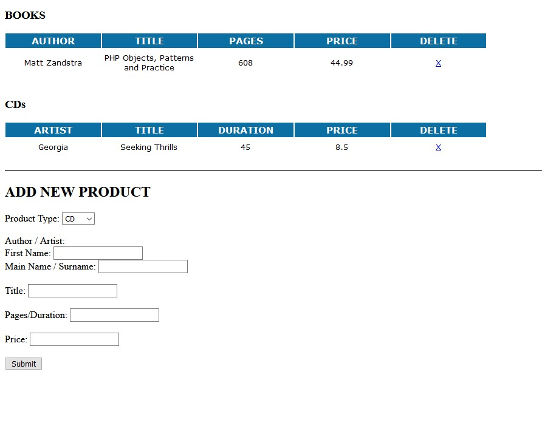
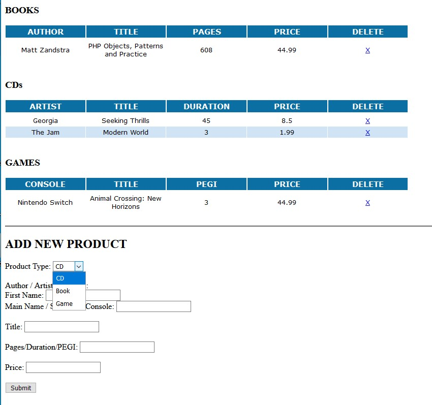

# Component 1 - Task

Currently index.php will display 2 tables and a form. Each table refers to a product type in a json file (Cds and Books).

Component 1 is about setting up your development environment, linking code to GIT, demonstrated through a short PHP task.

You are to add a new product type - GameProduct. This will follow the same format as the other products and extend the 
ShopProduct class. It's unique property will be 'pegi'. 
The form should allow for products of this type to be entered. 

The end result could take a form similar to:

## Additional Notes

This is a simple PHP project based on the example code in the
Matt Zandstra book PHP Objects, Patterns and Practice.

The code uses a json file to store some products which then has the
option of being passed back as a response as

<ul> 
<li>HTML -> Using HTMLProductWriter Class</li>
<li>JSON -> Using JSONProductWriter Class</li>
</ul>

The HTML writer (accessed through index.php) includes a form that will when submitted will POST data to the 
server which will be written to an updated JSON file (products.json).

GET variables are

 <ul>
 <li><em>delete</em> remove product from json file</li>
  <li><em>api</em> specify whether this is an API type request to return data as a json string</li>
  </ul>

To Note - the json file could have been returned directly but this step is there to
help visualise API writing methods if calling data directly from a database.

This project is lightweight and has no error checking.

